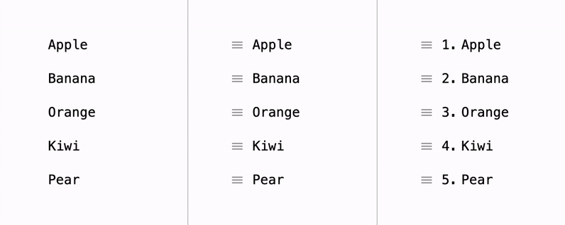

# Sorta

A simple yet powerful sortable list for React. It doesn't affect the DOM tree by itself: 
no styles are applied, and no elements are created or copied. It just provides 
`translate: {x: number; y: number}`property representing the elements offset values 
and operates only within single container that gives you freedom in applying styles 
(`transform`, `margin` or `left/top`) and keeps you safe if your CSS has cascade 
dependencies (`.container > .item {...}`) which obviously doesn't work with cloning 
and appending element to document.body.

Works automatically either in a vertical or horizontal direction. Supports scrolling
containers and virtualized lists.
